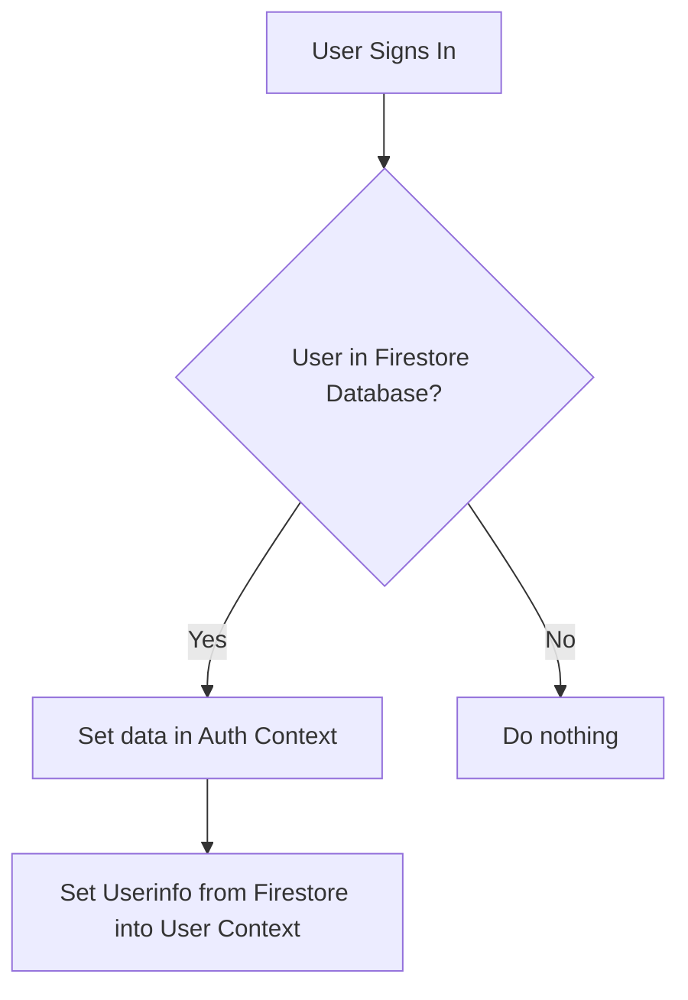
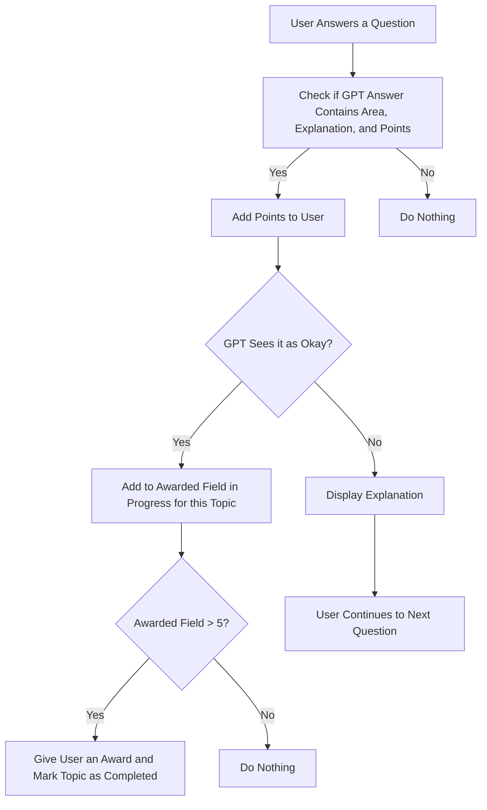

```mermaid

graph TB
  A[User Signs In] --> B{User in Firestore Database?}
  B --> |Yes| C[Set data in Auth Context]
  B --> |No| D[Do nothing]
  C --> E[Set Userinfo from Firestore into User Context]
```

```mermaid

graph TB
  A[User Answers a Question] --> B[Check if GPT Answer Contains Area, Explanation, and Points]
  B --> |Yes| C[Add Points to User]
  B --> |No| D[Do Nothing]
  C --> E{GPT Sees it as Okay?}
  E --> |Yes| F[Add to Awarded Field in Progress for this Topic]
  E --> |No| J[Display Explanation]
  F --> G{Awarded Field > 5?}
  G --> |Yes| H[Give User an Award and Mark Topic as Completed]
  G --> |No| I[Do Nothing]
  J --> K[User Continues to Next Question]
```
