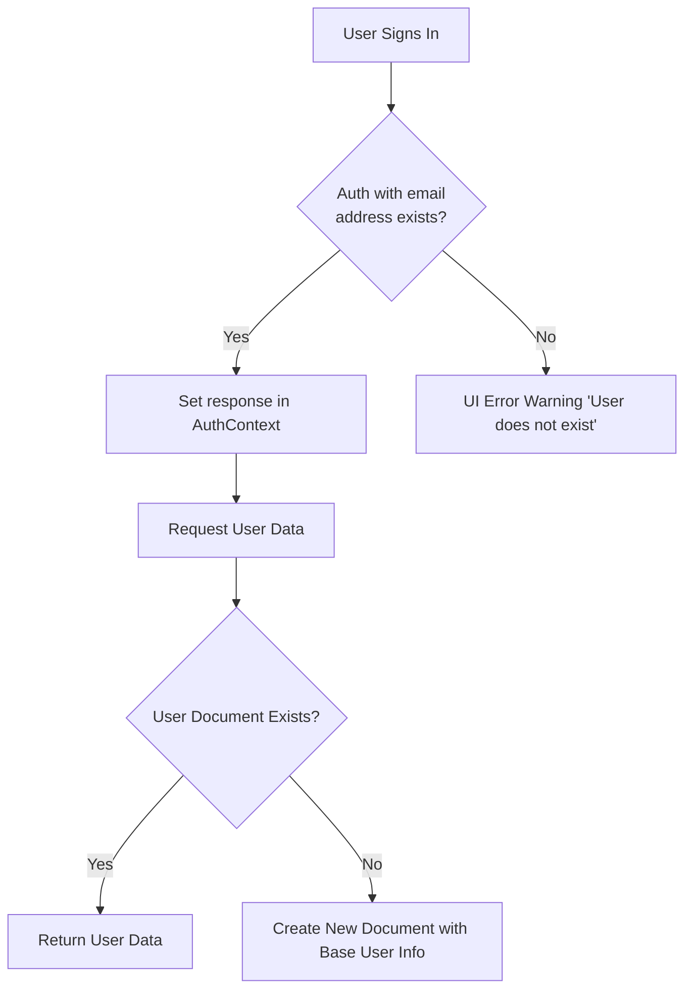
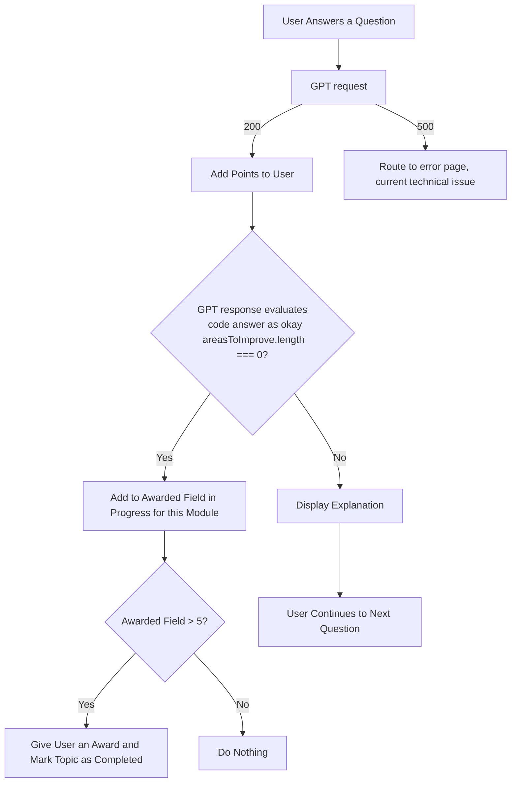

````mermaid

classDiagram
    class UserData {
        +ProgressType variables
        +ProgressType functions
        +ProgressType objects
        +ProgressType arrays
        +Number totalChallenges
        +Number points
        +Topic currentTopic
        +String[] awards
    }
    ```
````
