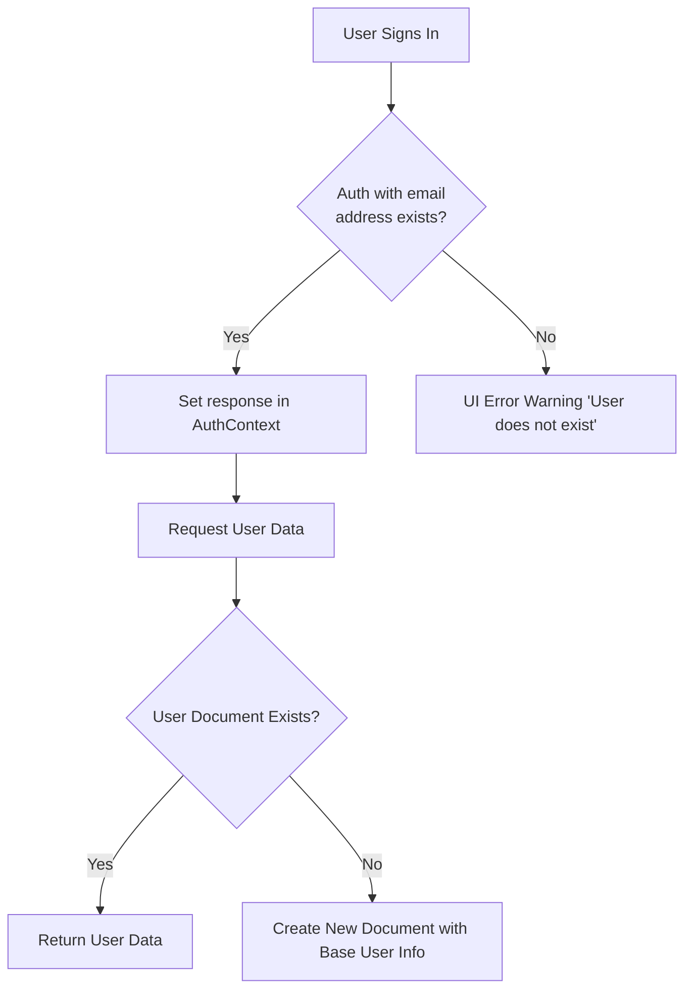
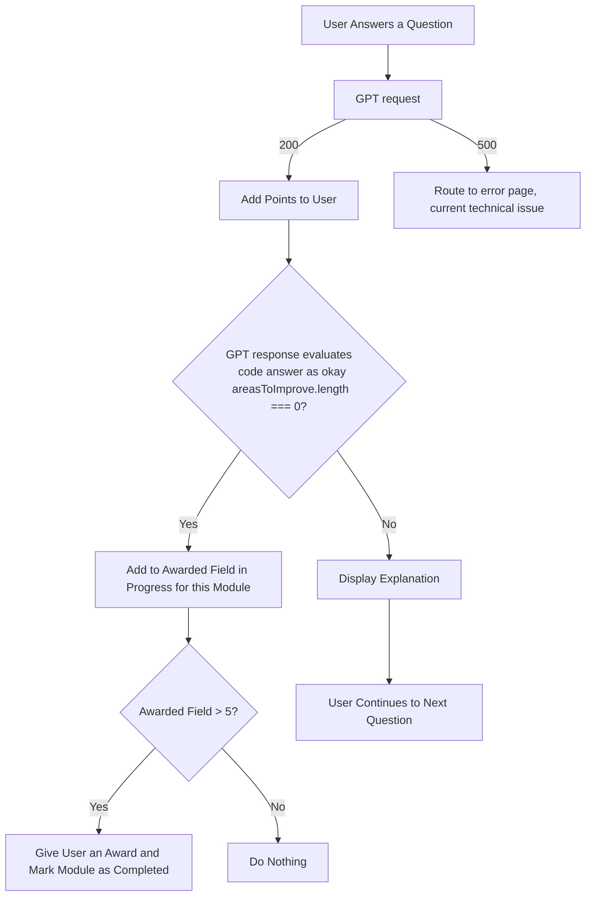
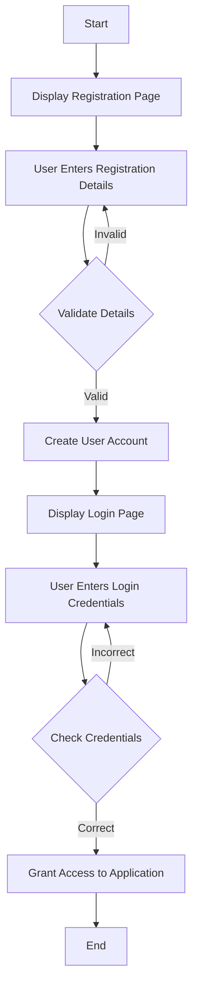
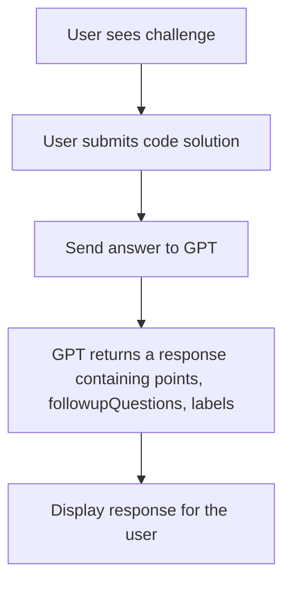
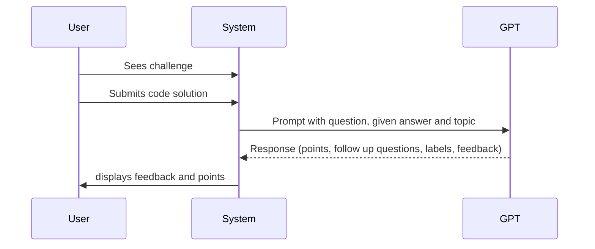
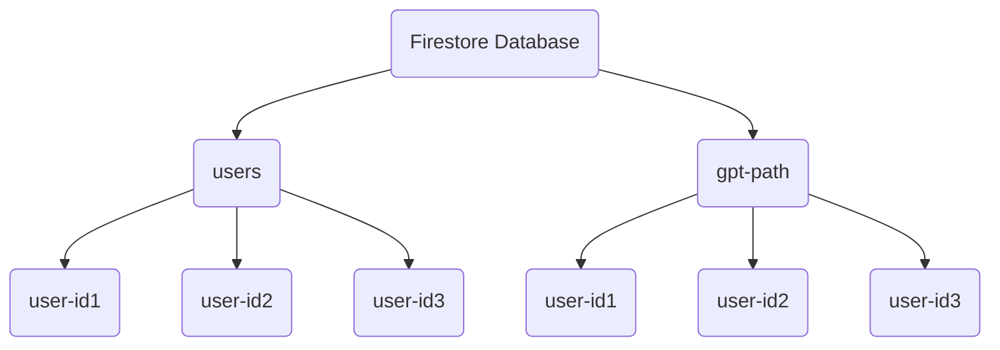
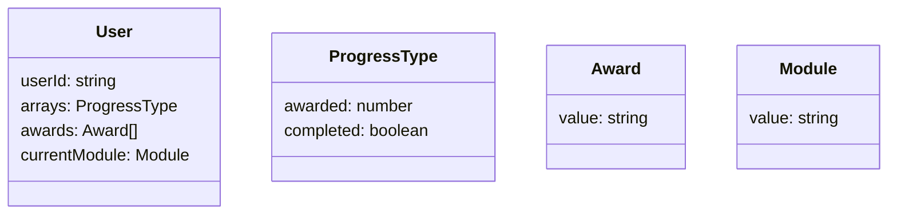

````mermaid

classDiagram
    class UserData {
        +ProgressType variables
        +ProgressType functions
        +ProgressType objects
        +ProgressType arrays
        +Number totalChallenges
        +Number points
        +Module currentModule
        +String[] awards
    }

````



flow



Sequence diagram



Database visualisation




